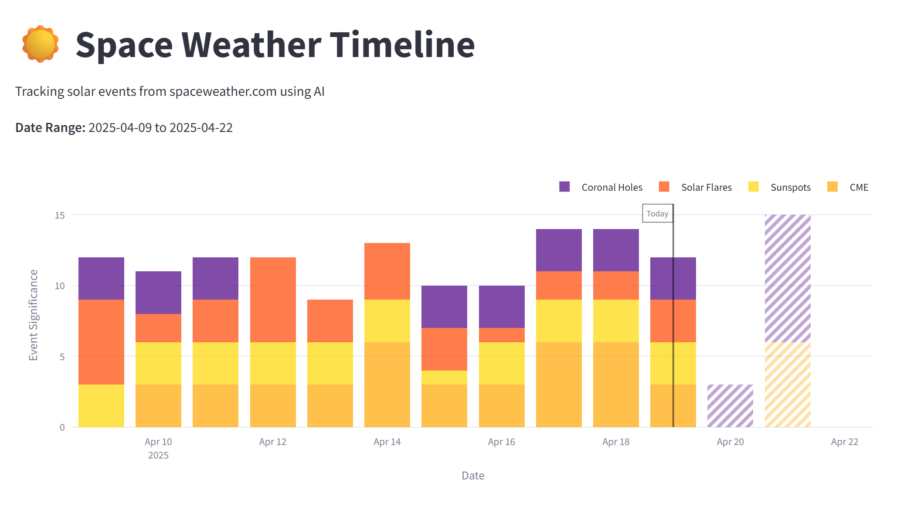

# Space Weather Timeline

A Streamlit application that scrapes data from [spaceweather.com](https://spaceweather.com), categorizes space weather events using configurable LLM models, and displays them in an interactive timeline visualization with an admin dashboard for data management and configuration.



## Features

- **Daily Data Scraping**: Automatically scrapes spaceweather.com for the latest space weather information
- **LLM-Powered Analysis**: Uses configurable LLM models (Grok or OpenRouter) to categorize and analyze space weather events
- **Interactive Timeline**: Visual representation of space weather events over time
- **Event Categorization**: Organizes events into four main categories:
  1. Coronal Mass Ejections (CME)
  2. Sunspot Activity
  3. Solar Flares
  4. Coronal Holes
- **Significance Highlighting**: Automatically identifies and highlights significant space weather events with taller bars in the timeline
- **Detailed Event Cards**: Click on any date to view detailed information about the events on that day
- **Admin Dashboard**: Password-protected admin section for data management, LLM configuration, and display settings
- **SQLite Database**: Local storage of space weather data for improved performance and reliability
- **Supabase Sync**: Synchronization with Supabase for cloud backup and sharing capabilities

## Installation

1. Clone this repository:
   ```
   git clone https://github.com/kongpop10/spaceweather-timeline.git
   cd spaceweather-timeline
   ```

2. Install the required dependencies:
   ```
   pip install -r requirements.txt
   ```

3. Set up your configuration:
   - Create a `.streamlit/secrets.toml` file with the following settings:
     ```
     # API Keys
     GROQ_API_KEY = "your-groq-api-key-here"
     OPENROUTER_API_KEY = "your-openrouter-api-key-here"
     XAI_API_KEY = "your-xai-api-key-here"

     # Admin password
     password = "your-admin-password"

     # LLM Configuration
     LLM_PROVIDER = "grok"  # Options: "grok" or "openrouter"
     LLM_BASE_URL = "https://api.x.ai/v1"
     LLM_MODEL = "grok-3-mini-beta"  # Default model for Grok
     LLM_REASONING_EFFORT = "low"  # Options: "low", "medium", "high" (for Grok model)

     # Site information for OpenRouter
     SITE_URL = "https://spaceweather-timeline.streamlit.app"
     SITE_NAME = "Space Weather Timeline"

     # Supabase Configuration
     SUPABASE_URL = "https://xvrhscffofntlwigyutk.supabase.co"
     SUPABASE_API_KEY = "your-supabase-api-key-here"
     ```

## Supabase Setup

To enable Supabase synchronization, you need to set up the required tables in your Supabase project:

1. Log in to your Supabase dashboard at [https://app.supabase.com/](https://app.supabase.com/)
2. Select your project
3. In the left sidebar, click on "SQL Editor"
4. Click "New Query" or select an existing query
5. Copy the SQL script from the `supabase_tables.sql` file in this repository
6. Paste the SQL script into the editor
7. Click "Run" to execute the script

This will create the necessary tables and indexes for storing space weather data in Supabase.

## Usage

Run the Streamlit app:
```
streamlit run app.py
```

The app will open in your default web browser. You can:
- View the timeline of space weather events for the last 14 days by default
- Adjust the date range using the slider in the sidebar
- Filter events by category using the checkboxes
- Click on any date in the timeline to view detailed event information
- Use the admin panel to import JSON data to SQLite and sync with Supabase
- The app automatically displays today's information in the event section by default

### Admin Features

To access the admin features:
1. Click on the "⚙️ Admin" expander in the sidebar
2. Enter your admin password and click "Login"
3. Once authenticated, you'll have access to:
   - **LLM Configuration**: Select between Grok and OpenRouter LLM providers, and configure their settings
   - **Data Management**: Import JSON data to SQLite, sync with Supabase, refresh data, and manage cache
   - **Controls**: Adjust display settings and filter event categories
   - **Logout**: End your admin session

### Database Migration

The app now uses SQLite for local storage instead of individual JSON files. To migrate your existing data:

1. Launch the app and log in to the admin panel
2. Click the "Import JSON to DB" button to import all existing JSON files to the SQLite database
3. (Optional) Click the "Sync with Supabase" button to sync your data to Supabase

After migration, the app will continue to save data in both JSON and SQLite formats for backward compatibility, but will primarily use SQLite for data retrieval.

## Project Structure

- `app.py`: Main Streamlit application
- `scraper.py`: Functions to scrape spaceweather.com
- `llm_processor.py`: Functions to process text with Grok or OpenRouter LLM
- `data_manager.py`: Functions to store and retrieve data
- `db_manager.py`: SQLite database management functions
- `supabase_sync.py`: Supabase synchronization functions
- `utils.py`: Utility functions
- `data/`: Directory where scraped and processed data is stored (including SQLite database)

## Requirements

- Python 3.7+
- Streamlit
- Requests
- BeautifulSoup4
- Pandas
- Plotly
- OpenAI (for API compatibility)
- SQLite (included in Python standard library)
- Grok API key (X.AI) or OpenRouter API key
- Supabase project and API key (for cloud sync)

## Shortcut Creation

The repository includes a VBS script to create a Start Menu shortcut for easy access:

1. Run the `create_shortcut.vbs` script to create a shortcut in your Start Menu
2. For detailed instructions, see the `SHORTCUT_INSTRUCTIONS.md` file

## Key Features

### Automatic Data Filling

The app uses LLM to automatically fill in missing data when you refresh the page. If there are dates in your selected range with no data, the app will attempt to use the LLM to analyze and categorize events for those dates.

### Collapsible Significant Events

Significant space weather events are displayed in a collapsible section that can be expanded to show detailed information about important solar activity.

### Image Height Limitation

All images in the event details are limited to a maximum height of 400px for better viewing experience.

### Dark Mode Compatible

The event view section is designed to be compatible with dark mode for comfortable viewing in low-light environments.

### Confirmation Warnings

The app displays confirmation warnings for potentially destructive actions like refreshing all data to prevent accidental data loss.

## Deployment

The app is currently deployed at: [https://spaceweather-timeline.streamlit.app](https://spaceweather-timeline.streamlit.app)

## Server/API Component

In addition to the Streamlit app, this project includes a server component that:

- Scrapes spaceweather.com data independently
- Uses OpenRouter API with the deepseek/deepseek-chat-v3-0324:free model for analysis
- Tracks solar events (eruptions, coronal holes, X-ray flares, sunspots)
- Provides structured data storage
- Exposes REST API endpoints for data access

## License

MIT
